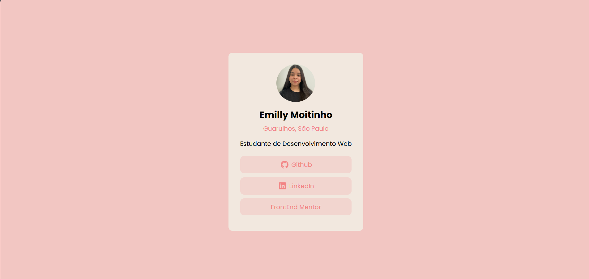

# Desafio do Frontend Mentor - Cartão de Perfil
Este é um projeto de um cartão de perfil desenvolvido como parte de um desafio do Frontend Mentor. O desafio consistia em criar um cartão de perfil que incluísse informações pessoais e links de redes sociais.

[Acesse]()

## Descrição
- Cartão de perfil: Exibe a foto, nome, localização e informações de estudante de desenvolvimento web.
- Botões de redes sociais: Inclui botões para acessar o GitHub, LinkedIn e Frontend Mentor.
- Design Responsivo: O layout é otimizado para diferentes tamanhos de tela, desde dispositivos móveis até desktops.

## Tecnologias Utilizadas
- HTML
- CSS

## Screenshot  📷

 
